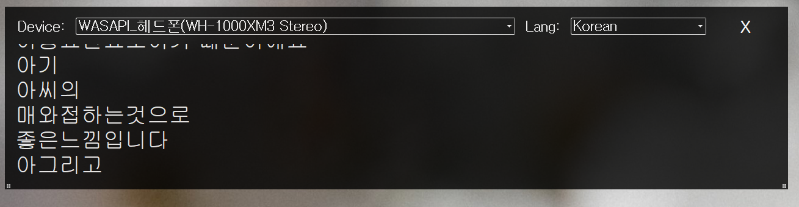
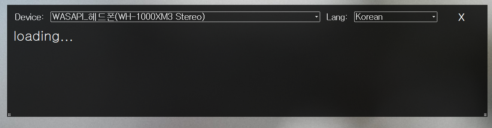

# wav2vec2-live-japanese-translator
Real time speech recognition translator using wav2vec2 and google translate    
uses finetuned facebook/wav2vec2-large-xlsr-53 and facebook/wav2vec2-large-960h-lv60-self  
it detect speaker (WASAPI for output loopback) and microphone (MME)

download latest from [](https://github.com/ttop32/wav2vec2-live-japanese-translator/releases/latest) 


  
# Result    
    
    

# Finetuned model detail
Test WER on Common Voice Japanese test data: 22.08%   
Test CER on Common Voice Japanese test data: 10.08%   

Fine-tuned facebook/wav2vec2-large-xlsr-53 on Japanese hiragana using
- [common_voice](https://huggingface.co/datasets/common_voice)     
- [JSUT](https://sites.google.com/site/shinnosuketakamichi/publication/jsut)     
- [CSS10](https://github.com/Kyubyong/css10)     
- [TEDxJP-10K](https://github.com/laboroai/TEDxJP-10K)     
- [JVS](https://sites.google.com/site/shinnosuketakamichi/research-topics/jvs_corpus)
  
# Required environment to run   
```python
conda create -n torch python=3.6   
conda activate torch    
conda install pytorch==1.9.1 torchvision torchaudio==0.9.0 cudatoolkit=11.1 -c pytorch -c nvidia -c conda-forge
pip install datasets==1.11.0  
pip install transformers==4.11.2  
pip install ipywidgets  
pip install jiwer  
pip install pykakasi  
pip install mecab-python3  
pip install unidic-lite

#gui
conda install pytorch==1.9.0 torchaudio==0.9.0 cudatoolkit=10.2 -c pytorch
pip install transformers==4.11.2  
pip install PySoundFile
pip install PyAudio-0.2.11-cp36-cp36m-win_amd64.whl
pip install webrtcvad
pip install googletrans==4.0.0rc1
pip install PyQt5
pip install scipy
pip install pyinstaller
```

# Model finetune code
jp_train.ipynb  

# Run gui using python
```python
python gui_handler.py
```

# pyinstaller
```python
pyinstaller gui_handler.py -y -n wav2vec2_live_japanese_translator --hidden-import=pytorch --collect-data torch --copy-metadata torch --copy-metadata tqdm --copy-metadata regex --copy-metadata sacremoses --copy-metadata requests --copy-metadata packaging --copy-metadata filelock --copy-metadata numpy --copy-metadata tokenizers --copy-metadata importlib_metadata  --copy-metadata dataclasses
```


# Acknowledgement and References  
- [wav2vec 2.0](https://arxiv.org/abs/2006.11477)
- [nlp bookmark](https://github.com/hyunjun/bookmarks/blob/master/nlp.md)
- [wav2vec2.0 review1](https://ratsgo.github.io/speechbook/docs/neuralfe/wav2vec)
- [wav2vec2.0 review2](https://kaen2891.tistory.com/83)
- [asr base](https://lynnshin.tistory.com/42)
- [fine-tune-xlsr-wav2vec2](https://huggingface.co/blog/fine-tune-xlsr-wav2vec2)
- [fine-tune-xlsr-wav2vec2-colab](https://colab.research.google.com/github/patrickvonplaten/notebooks/blob/master/Fine_Tune_XLSR_Wav2Vec2_on_Turkish_ASR_with_%F0%9F%A4%97_Transformers.ipynb)
- [wav2vec_japanese](https://colab.research.google.com/github/yuji-matsunami/wav2vec_japanese/blob/main/wav2vec_ja.ipynb)
- [facebook/wav2vec2-large-960h-lv60-self](https://huggingface.co/facebook/wav2vec2-large-960h-lv60-self)
- [facebook/wav2vec2-large-xlsr-53](https://huggingface.co/facebook/wav2vec2-large-xlsr-53)
- [wav2vec2-large-xlsr-japanese-hiragana](https://huggingface.co/vumichien/wav2vec2-large-xlsr-japanese-hiragana)
- [wav2vec2-large-xlsr-japanese](https://huggingface.co/vumichien/wav2vec2-large-xlsr-japanese)
- [wav2vec2-large-xlsr-53-japanese](https://huggingface.co/jonatasgrosman/wav2vec2-large-xlsr-53-japanese)
- [wav2vec2-large-japanese](https://huggingface.co/NTQAI/wav2vec2-large-japanese)
- [common_voice](https://huggingface.co/datasets/common_voice)     
- [JSUT](https://sites.google.com/site/shinnosuketakamichi/publication/jsut)     
- [CSS10](https://github.com/Kyubyong/css10)     
- [TEDxJP-10K](https://github.com/laboroai/TEDxJP-10K)     
- [JVS](https://sites.google.com/site/shinnosuketakamichi/research-topics/jvs_corpus)
- [speech-japanese-korean-vietnamese](http://www.hieuthi.com/blog/2018/04/22/speech-japanese-korean-vietnamese.html)
- [Pykakasi](https://github.com/miurahr/pykakasi)
- [mecab-python3](https://github.com/SamuraiT/mecab-python3)
- [wav2vec2-live](https://github.com/oliverguhr/wav2vec2-live)     
- [pyaudio_portaudio](https://github.com/intxcc/pyaudio_portaudio)     
- [pororo - wav2vec2](https://github.com/kakaobrain/pororo/blob/7d05a75e8062b00e6b65364b8ec6c52b6293ab07/pororo/models/wav2vec2/recognizer.py)
- [DeepSpeech-examples](https://github.com/mozilla/DeepSpeech-examples/blob/r0.9/mic_vad_streaming/mic_vad_streaming.py)
- [Hide the title bar](https://clay-atlas.com/us/blog/2021/03/04/pyqt5-cn-hide-title-bar-move-interface/)
- [Window resize](https://stackoverflow.com/questions/62807295/how-to-resize-a-window-from-the-edges-after-adding-the-property-qtcore-qt-framel)
- [QThread](https://wikidocs.net/87141)
- [googletrans](https://github.com/ssut/py-googletrans)
- [tqdm427_error](https://www.reddit.com/r/learnpython/comments/npvyd5/no_package_meta_data_for_tqdm427_error_while/)
- [hulk89_ctc](https://hulk89.github.io/machine%20learning/2018/01/30/ctc/)
- [ratsgo_ctc](https://ratsgo.github.io/speechbook/docs/neuralam/ctc)
- [huggingface](https://huggingface.co/)
